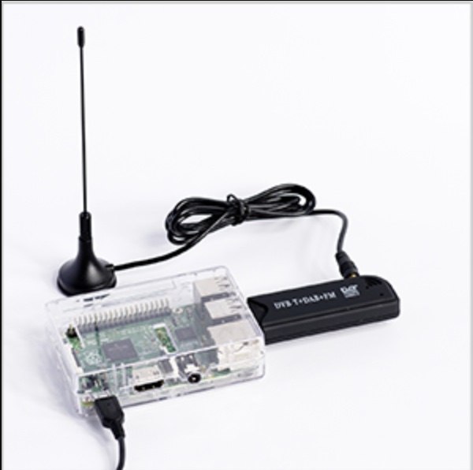
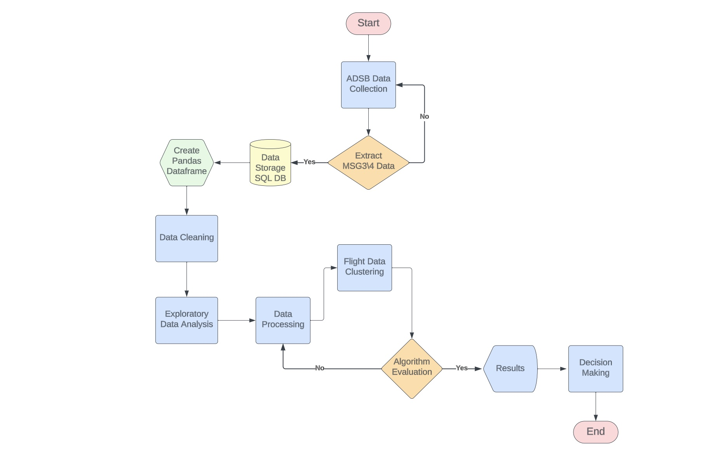
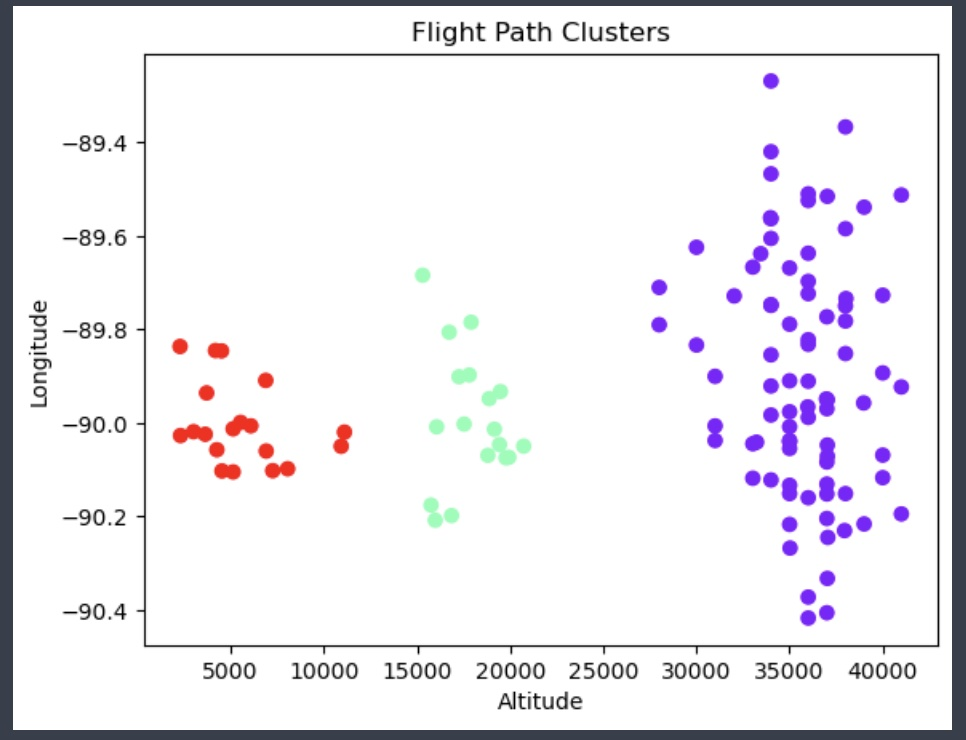

# Flight Patterns Clustering using ML Algorithm

Author: Pasquale Salomone
 
Date: November 3, 2023

## Overview

This project is dedicated to the exploration of flight patterns using machine learning algorithms, specifically K-Means and Mean Shift.The primary objective is to cluster flight data based on relevant features, aiming to uncover potential flight patterns within the geographical area surrounding the ADSB receiver. Unlike traditional machine learning tasks, the dataset is not divided into training and testing sets, as the test set lacks true labels. Instead, the focus is on unsupervised clustering to group flights based on their characteristics. The ultimate goal is to gain insights into flight behavior and identify distinct patterns within the region of interest.

## Prerequisites

1. Git
1. Python 3.7+ (3.11+ preferred)
1. VS Code Editor
1. VS Code Extension: Python (by Microsoft)

The following modules are required: 

| Module          | Version  |
|-----------------|----------|
| time            | 3.11.4   |
| collections     | 3.11.4   |
| pandas          | 1.5.3    |
| numpy           | 1.23.2   |
| folium          | 0.13.1   |
| matplotlib      | 3.5.3    |
| os              | 1.11.0   |
| haversine       | 3.2.1    |
| sqlite3         | 3.39.2   |
| linregress      | 1.9.3    |

## Data Sources

The project utilizes live data from FlightAware, a leading provider of aviation data and flight tracking information, through PiAware 7.2 running on a Raspberry PI. The original data sources include various flight-related information such as aircraft identifiers, timestamps, altitude, latitude, longitude, speed, heading, and transponder codes.

## Resources

- [FlightAware](https://www.flightaware.com/)
- [Automatic Dependent Surveillance - Broadcast (ADS-B)](https://www.faa.gov/about/office_org/headquarters_offices/avs/offices/afx/afs/afs400/afs410/ads-b)
- [PiAware](https://blog.flightaware.com/piaware-7-release#:~:text=PiAware%207%20has%20several%20new,(SD%20Card%20Image%20only).)
- [Transponder Codes](https://code7700.com/transponder.htm)

## Deployment

+ Project7Notebook.ipynb It is a Jupyter Notebook which executes Data Collection, Exploratory Data Analysis (EDA), Data Preprocessing, Model Fitting and Evaluation, and display results.
  
+ adsb_flight_data.py Contains the script for receiving and processing data from an Automatic 
  Dependent Surveillance-Broadcast (ADS-B) system.
  
+ adsb_functions.py Contains the data description language (DDL) syntax for creation of tables as well as the data manipulation language (DML) for inserting data, and the the function (data_stream_and_store) the continuous streaming and storage of data received from a network socket connected to a Raspberry Pi running Pi Aware 7.2. 

## Flowchart

## Video

## Acknowledgments

I would like to acknowledge Stackoverflow, ChatGPT, Google Bard as an instrumental aid in the development of this project.

## License

This project is licensed under the MIT License.

