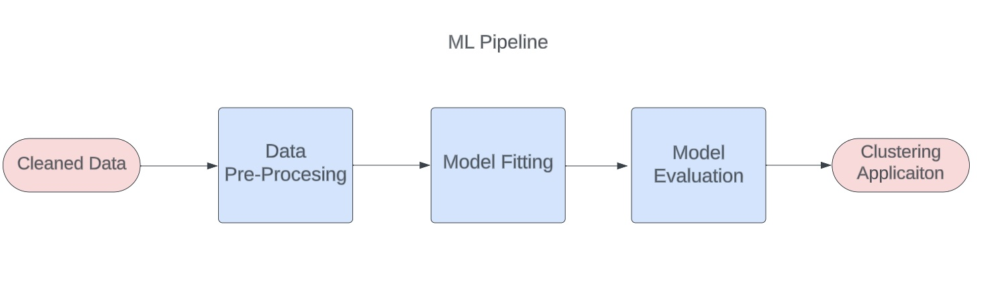
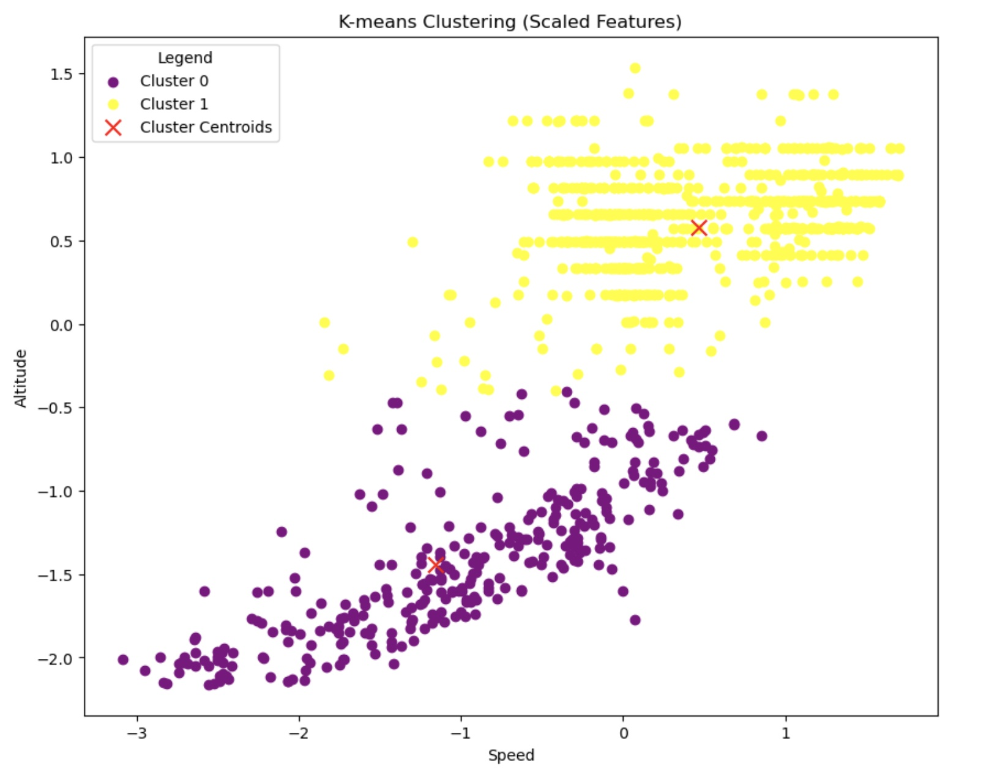

# Flight Patterns Clustering using ML Algorithm

Author: Pasquale Salomone
<br>
Date: November 3, 2023

## Overview


<p>This project delves into leveraging machine learning techniques to categorize flights based on similar altitude and speed patterns within a specific geographic re-gion, namely Southern Illinois. Specifically, it investigates and assesses two non-parametric clustering algorithms, K-means clustering and Mean Shift.The application of these clustering algorithms results in cluster labels for each data point, subsequently added as new features to the original dataset. Ultimately, the analysis of the data unveils a bustling airspace in the targeted geographical area, revealing two distinctive clusters indicative of diverse movement patterns or trajectories.</p>


## Prerequisites

1. Git
1. Python 3.7+ (3.11+ preferred)
1. VS Code Editor
1. VS Code Extension: Python (by Microsoft)

The following modules are required: 


```
import pandas as pd
import numpy as np
import hashlib
import folium
import matplotlib.pyplot as plt
import matplotlib.cm as cm
import os
import haversine
from folium.plugins import HeatMap
from folium import PolyLine
import sqlite3
from shapely.geometry import Point
from scipy.stats import linregress
from prettytable import PrettyTable
import seaborn as sns
import matplotlib.pyplot as plt
from IPython.display import display, HTML
```


## Data Sources

The project utilizes de-identified synthetic streamed data, from an Automatic Dependent Surveillance–Broadcast (ADS-B) receiver connected to a Raspberry Pi running Pi Aware 7.2. Synthetic data ensure anonymization( remove or hash any columns that contain PII), randomization (randomize data elements that should not be traceable to individual flights), maintains statistical properties (ensure that the synthetic data maintains the same statistical properties as the original data, such as the mean, variance, and distribution of numerical variables), and maintain relationships (preserve any relationships or correlations between variables that are present in the real data). The original data sources include various flight-related information such as aircraft identifiers, timestamps, altitude, latitude, longitude, speed, heading, and transponder codes.

## Resources

- [FlightAware](https://www.flightaware.com/)
- [Automatic Dependent Surveillance - Broadcast (ADS-B)](https://www.faa.gov/about/office_org/headquarters_offices/avs/offices/afx/afs/afs400/afs410/ads-b)
- [PiAware](https://blog.flightaware.com/piaware-7-release#:~:text=PiAware%207%20has%20several%20new,(SD%20Card%20Image%20only).)
- [Transponder Codes](https://code7700.com/transponder.htm)


## Deployment

+ Project7Notebook.ipynb It is a Jupyter Notebook which executes Data Collection, Exploratory Data Analysis (EDA), Data Preprocessing, Model Fitting and Evaluation, and display results.
  
+ adsb_flight_data.py Contains the script for receiving and processing data from an Automatic 
  Dependent Surveillance-Broadcast (ADS-B) system.
  
+ adsb_functions.py Contains the data description language (DDL) syntax for creation of tables as well as the data manipulation language (DML) for inserting data, and the the function (data_stream_and_store) the continuous streaming and storage of data received from a network socket connected to a Raspberry Pi running Pi Aware 7.2. 


## Outputs

+ syntethic_flight_data.csv Contains the 1032 records used for the project.
## Flowchart




## Results

<p>K-means clustering reveals the presence of two distinct clusters, indicating potential differentiation in movement patterns or trajectories. Cluster 0 is characterized by lower speeds and altitudes, suggesting a mode of movement with reduced intensity. In contrast, Cluster 1 exhibits higher speeds and
altitudes, indicative of a more dynamic and elevated trajectory which could align with the cruising phase. The broader ranges in both speed and altitude
observed in Cluster 0 imply a higher variability in movement compared to the more constrained patterns found in Cluster 1 which could align with the
dynamic and variable nature of the takeoff phase. These findings provide insights into the diverse nature of the underlying data, highlighting distinct
patterns in the two identified clusters. </p>



## Acknowledgments

I would like to acknowledge Stackoverflow, ChatGPT, Google Bard as an instrumental aid in the development of this project.

## License

This project is licensed under the MIT License.


